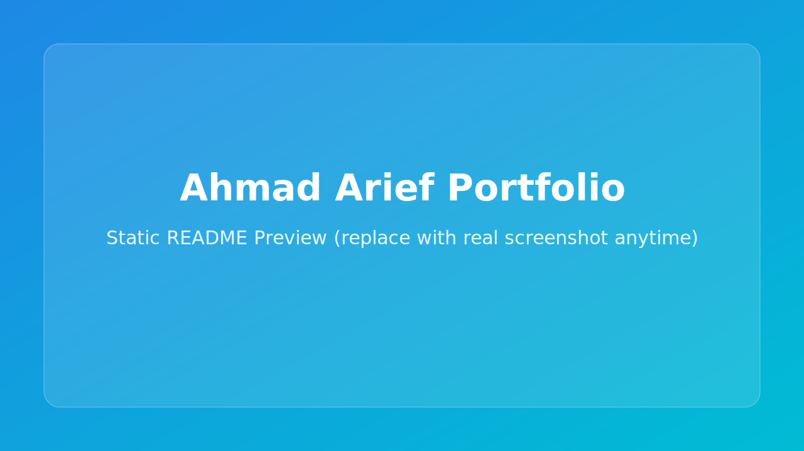

# Ahmad Arief bin Omar | Interactive Portfolio

An interactive personal portfolio and CV built with Streamlit to present my background, experience, technical skills, and selected projects in a clean, modern web format.

## Preview

➡️ **Open the live portfolio:** https://ahmad-arief-portfolio.streamlit.app/

## Live App

🔗 https://ahmad-arief-portfolio.streamlit.app/

## Portfolio Content

- **Professional Summary**
- **Work Experience**
- **Technical Skills**
- **Featured Projects**
- **Education**
- **Contact Information**

## Tech Stack

- **Python**
- **Streamlit**

## Profile

- **GitHub:** https://github.com/Izumi47
- **LinkedIn:** https://linkedin.com/in/ahmad-arief
